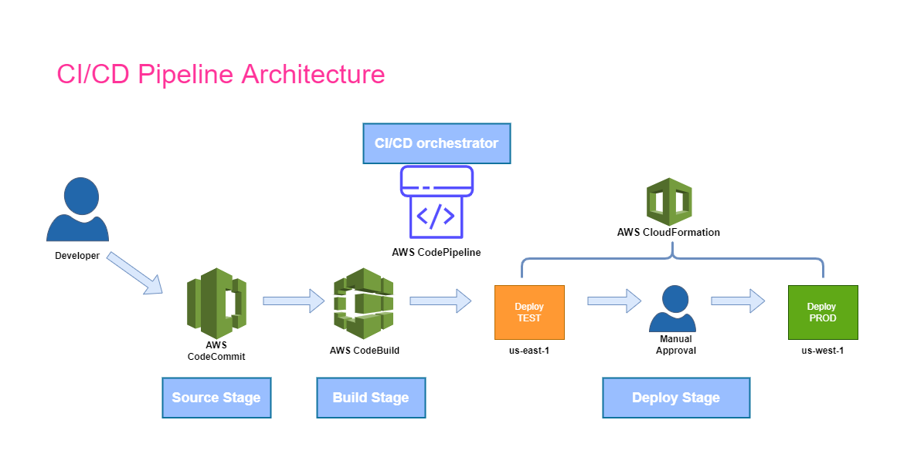

# 3-stage-webserver-pipeline-repo

CI/CD pipeline for multi-region deployment with AWS CodePipeline

Build a three-stage pipeline to deploy a CloudFormation template.
- Variant 1: Using AWS CodeCommit and AWS CodePipeline.
- Variant 2: Using GitHub and AWS CodePipeline.

Used cfn-lint tool to test the template on the build stage.

- DIAGRAM:

